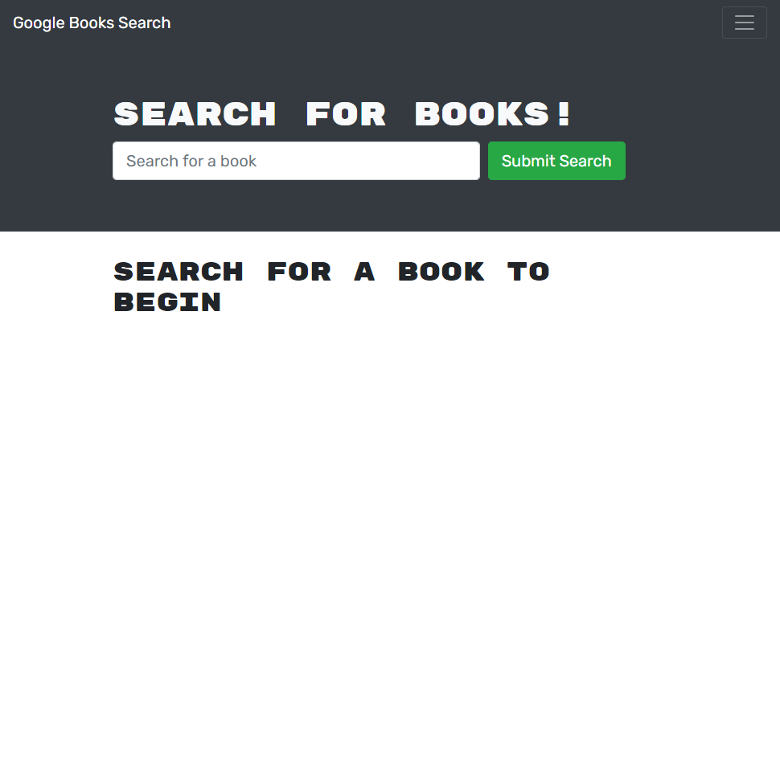
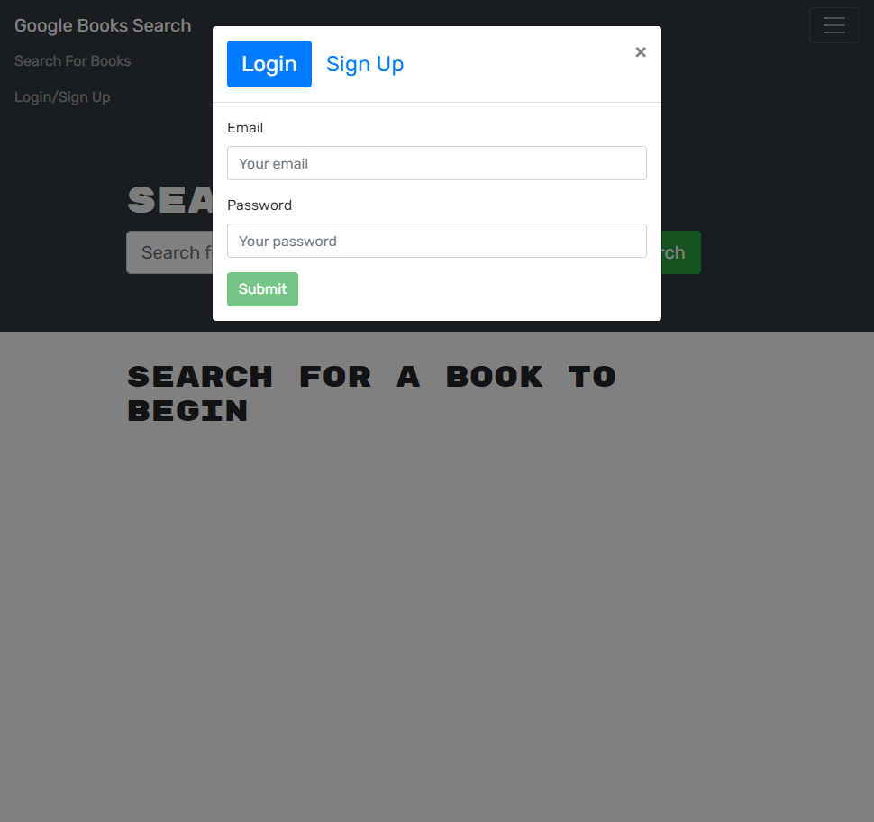
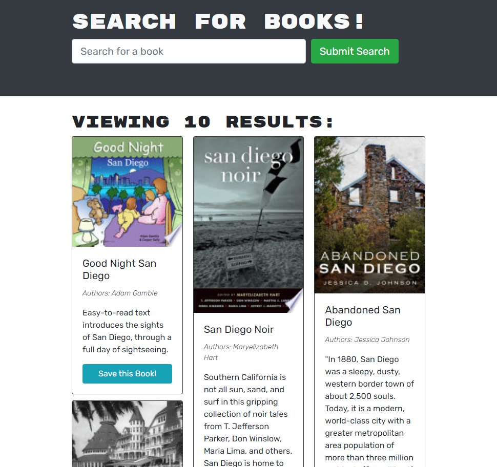

# MERN Book Search

An application that utilizes MERN stack to allow users to create a profile, search for books and add it their own list of saved books to refer to later.

## Table of contents

- [Usage](#usage)
- [Test](#test)
- [Credits](#credits)
- [License](#license)
- [Contribute](#contribute)
- [Questions](#questions)

## Usage

First navigate to the app <a href="https://calm-savannah-91120.herokuapp.com/">here </a>. You may either search for books but in order to save books, you must first log-in/register.

## Credits

I would like to thank My friends, family, and instructors at UCSD bootcamp. for their support during the development of this application.

## License

This project is licensed under None.

## Contribute

Please contact me prior to contributing to shi application.

## Questions

If you have any questions, please direct them towards my email at Jimmyqv.tran@gmail.com.  
 You can find more of my work at github.com/yippeejimmee.

